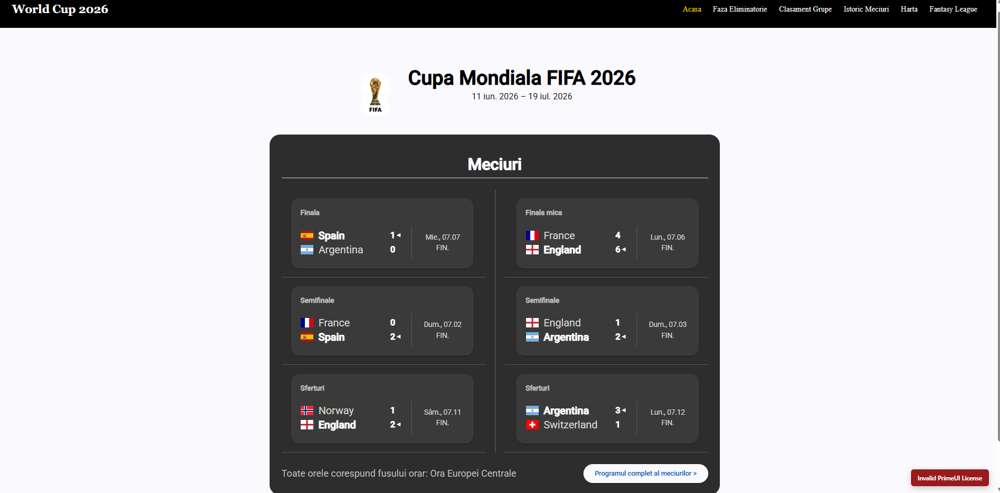
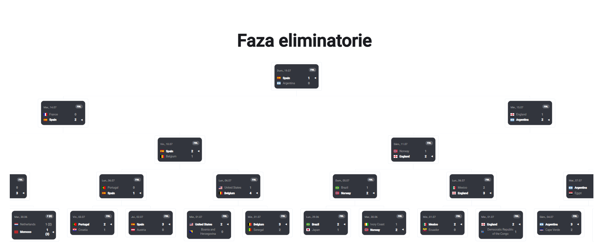
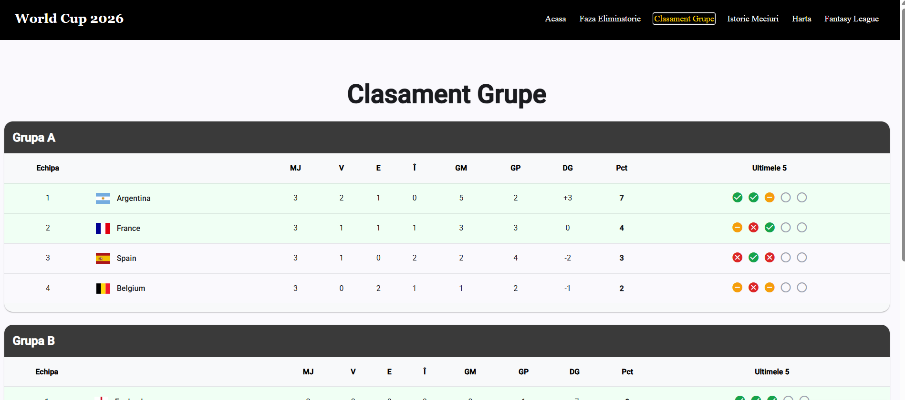
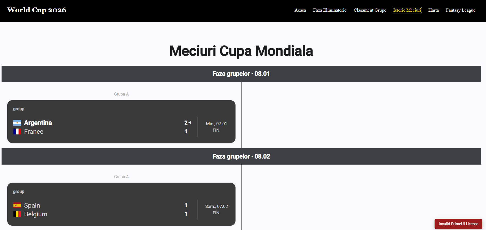
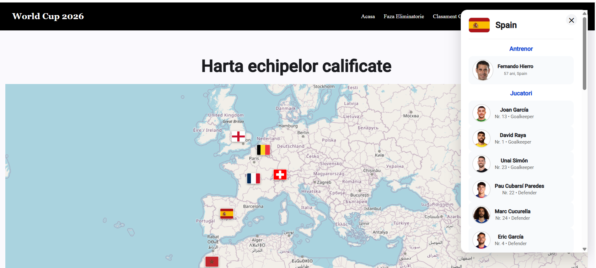
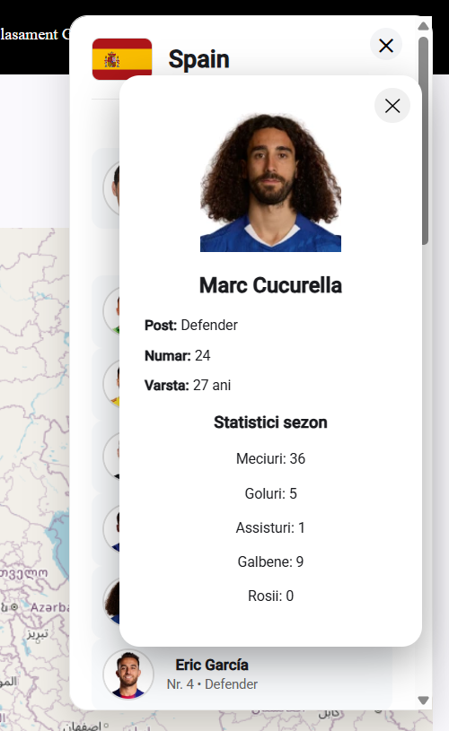
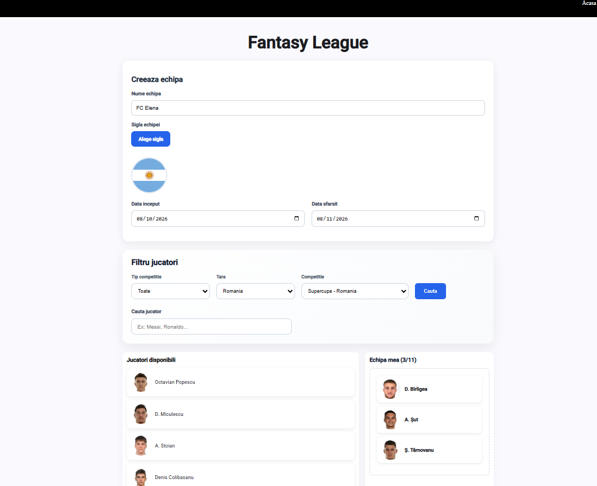
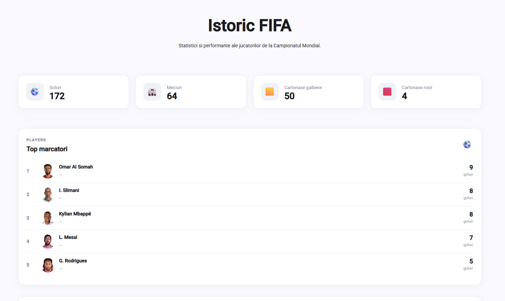

# Smart Digital World Cup

Aplicatia web Smart Digital World Cup este o solutie interactiva pentru urmarirea competitiei FIFA World Cup 2026, construita cu Angular. Scopul proiectului este de a centraliza informatiile despre turneu intr-o interfata moderna si usor de folosit.

## Ce ofera aplicatia

Aplicatia include mai multe module principale:

- Pagina principala cu meciurile si informatii despre turneu
- Clasamentul grupelor pentru fiecare serie de echipe
- Faza eliminatorie cu structura de tip bracket
- Istoricul meciurilor si rezultatelor
- Harta echipelor calificate
- Sectiunea Fantasy League pentru crearea unei echipe si filtrarea jucatorilor

# Functionalitati principale

Aplicatia este impartita in mai multe module, fiecare avand un rol bine definit:

## Acasa (Home)

Pagina principala ofera o imagine de ansamblu asupra competitiei si contine:

- rezultatele celor mai recente meciuri;
- lista meciurilor programate;
- informatii generale despre turneu;
- carduri interactive pentru fiecare meci.



## Faza eliminatorie

Modul dedicat fazei eliminatorii afiseaza competitia sub forma unui **bracket**.

Acesta include:

- optimi;
- sferturi de finala;
- semifinale;
- finala.

Pentru fiecare meci sunt afisate:

- echipele participante;
- scorul (daca meciul este incheiat);
- data si ora disputarii.

Prin selectarea unui meci se deschide o fereastra cu informatii suplimentare cum ar fi:

- scorul, data.ora;
- jucatorii care au dat gol;
- jucatorii care au batut penalty;
- detalii despre stadionul pe care s-a jucat.



## Clasamentul grupelor

Aplicatia afiseaza clasamentul fiecarei grupe participante la Campionatul Mondial.

Pentru fiecare echipa sunt prezentate:

- pozitia in grupa;
- numarul de meciuri jucate;
- victorii;
- egaluri;
- infrangeri;
- goluri marcate si primite;
- punctajul acumulat.



## Istoric meciuri

Aceasta sectiune permite consultarea tuturor meciurilor disputate.

Meciurile sunt organizate:

- dupa faza grupelor;
- dupa faza eliminatorie.

Pentru fiecare meci sunt afisate:

- echipele;
- scorul final;
- data la care s-a jucat.



## Harta echipelor participante

Aplicatia include o harta interactiva realizata cu **MapLibre/Mapbox**.

Functionalitati:

- afisarea echipelor participante prin markere;
- tooltip la pozitionarea cursorului peste marker;
- fereastra cu informatii detaliate la selectarea unei echipe.

In cadrul ferestrei sunt prezentate:

- numele tarii;
- steagul;
- antrenorul;
- lotul de jucatori;
- informatii suplimentare despre echipa.




## Fantasy League

Utilizatorul isi poate crea propria echipa Fantasy.

Functionalitatile disponibile includ:

- alegerea numelui echipei;
- incarcarea unei sigle personalizate;
- selectarea intervalului de meciuri;
- alegerea jucatorilor;
- organizarea echipei prin mecanism de **Drag & Drop**.



## Statistics

Utilizatorul poate consulta statistici despre jucatorii si meciurile de la Campionatul Mondial.

Functionalitatile disponibile includ:

- afisarea numarului total de goluri;
- afisarea numarului total de meciuri;
- afisarea numarului de cartonase galbene si rosii;
- afisarea **topului marcatorilor**;
- afisarea **topului jucatorilor cu assist-uri**;
- analiza datelor prin intermediul **graficelor**;
- afisarea distributiei rezultatelor: **victorii, egaluri si infrangeri**;
- afisarea unui clasament al jucatorilor in functie de cartonase.



## Structura principala a proiectului

```
src/app/
  pages/          # pagini ale aplicatiei
  shared/         # componente reutilizabile
  services/       # servicii pentru date si logica aplicatiei
  models/         # modele TypeScript
  data/           # date pentru atunci cand API uirle sunt offline
```

# Componente principale

## Home

- Match Section
- Match Card

## Faza eliminatorie

- Bracket
- Knockout Bracket
- Knockout Column
- Knockout Match Card
- Match Details Dialog
- Organization Bracket

## Clasamentul grupelor

- Group Table
- Last Five
- Legend

## Istoric meciuri

- Matches History Section
- Match Card

## Harta

- Map Component
- Team Marker
- Team Tooltip
- Team Details
- Player Details

## Fantasy League

- Team Form
- Player List
- Selected Team

## Statistici

- Statistics Overview
- Top Scorers
- Top Assists
- Statistics Charts
- Cards Ranking

## Tehnologii utilizate

- Angular 22
- TypeScript
- Angular Material
- PrimeNG
- RxJS
- MapLibre / Mapbox pentru harti
- Brackets viewer pentru arborele competitiei
- HTML
- CSS

## Cerinte de sistem

- Node.js 20+
- npm 10+

## Instalare

```bash
npm install
```

## Rulare in dezvoltare

```bash
npm start

ng serve -o
```

Dupa pornirea serverului, deschideti browserul la adresa:

```text
http://localhost:4200/
```

## Configurarea cheii API

Proiectul utilizeaza un fisier `environment.ts` pentru configurarea cheii API.

1. Copiati fisierul:

```text
src/environments/environment.example.ts
```

in

```text
src/environments/environment.ts
```

2. Completati cheia API:

```ts
export const environment = {
  production: false,
  apiSportsKey: 'YOUR_API_KEY_FROM_API_SPORTS',
};
```

[API-Football](https://www.api-football.com/)

## Rulare cu Docker

Aplicatia este containerizata si servita prin Nginx folosind Docker si Docker Compose.

### Pornire

Din folderul proiectului:

```bash
docker compose up -d
```

Dupa pornire, aplicatia este disponibila la:

```text
http://localhost:8080/
```

### Oprire

Pentru a opri aplicatia:

```bash
docker compose down
```

### Verificarea containerului

Pentru a verifica daca containerul ruleaza:

```bash
docker ps
```

Pentru a vedea logurile containerului:

```bash
docker logs world-cup-digitalapp-web-1
```

### Actualizarea aplicatiei dupa modificari

Daca au fost facute modificari in codul Angular:

```bash
docker compose build --no-cache
```

Astfel, aplicatia este reconstruita si pornita cu noua versiune.

## Build pentru productie

```bash
npm run build
```

## Testare

```bash
npm test
```
